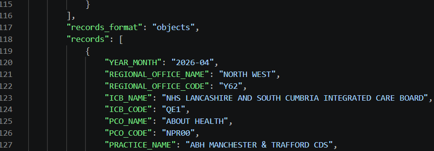
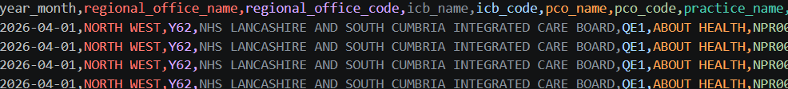
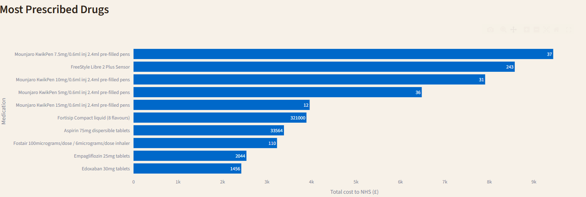
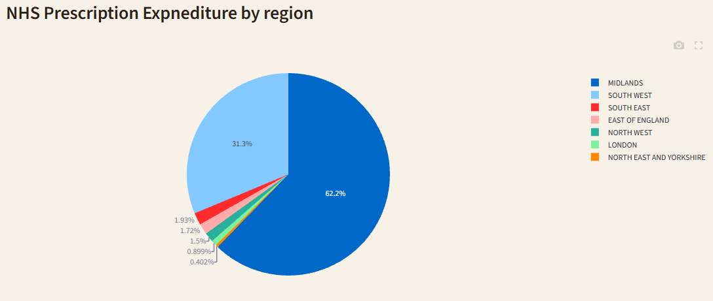
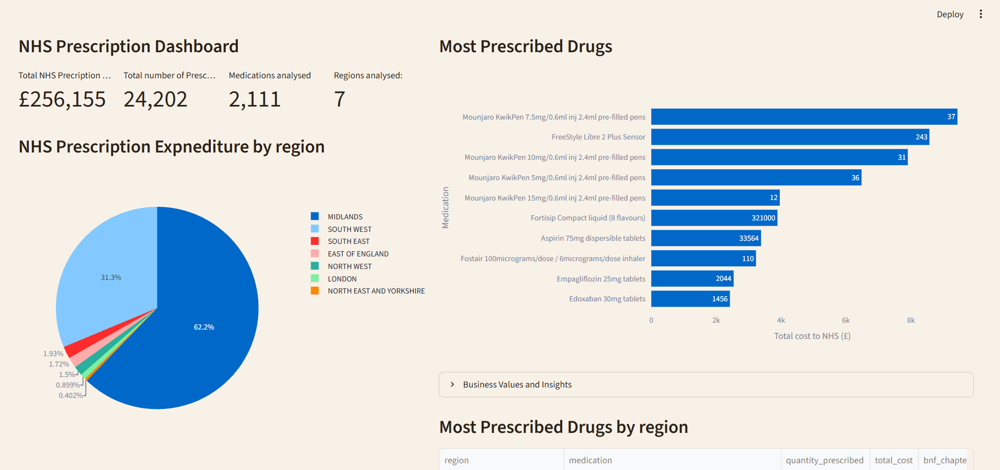
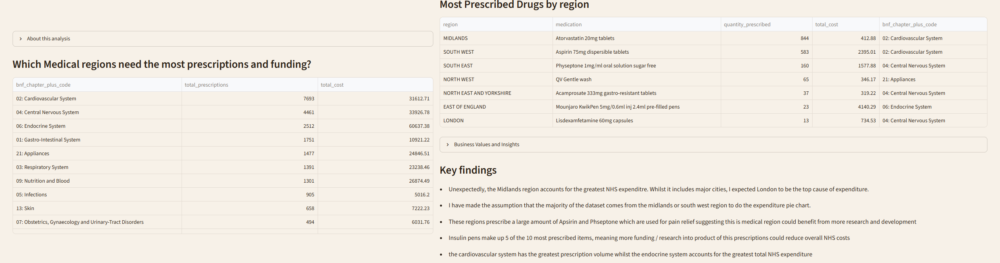

# NHS Prescription Data Pipeline

## Overview
This project follows a data engineering workflow, on NHS prescription analysis. It it collects prescription data from the open NHS API. 5002 records are downloaded and stored as a raw JSON file, before being converted to pandas dataframe, explored and cleaned. The processed dataset is stored in a postgreSQL database where it is queried to answer selected business questions. Visualisations, such as graphs, charts and tables are created using these findings and presented on a Streamlit dashboard.

## Key Features
- Extracting over 5000 records from NHS API
- Processing and cleaning data using pandas and numpy methods
- Data saved to postgreSQL database
- Queriying SQL database
- Building visualisations using query results
- Building Streamlit dashboard using visualisations and insights

## Workflow
1. Prescription downloaded from NHS API
2. Data is stored as json and converted as csv file
3. Data is converted to pandas dataframe and explored
4. After exploration, data is cleaned to make it appropriate for analysis
5. Processed data is stored in sql database
6. PostgreSQL database is queried to answer business questions
7. Visualisations with matplotlib and plotly using information gathered
8. Streamlit dashboard presents findings and insights with visualisations

## Project Structure

    ├── nhs-health-data-pipeline
    ├── analysis                             code for analysing cleaned dataset 
    │   ├── dashboard.py                     creates streamlit dashboard with visulaisations and inisights
    │   ├── exploration.py                   contains methods for exploring / queriying sql database
    │   ├── queries.py                       contains methods for queriying database
    │   ├── report.md                        explanation of my business questions 
    │   └── visualisation.py                 build graphs using data from queries
    │
    ├── data                                 Data storage
    │   ├── processed
    │   │      └── epd_clean.csv             holds processed / cleaned data, used for exploration and saving to postgreSQL database
    │   └── raw
    │        └── epd1.json                   raw data downloaded from NHS prescription database
    │
    ├── pictures                             pictures used in Github Readme
    │
    ├── sql                                  SQL methods
    │    └── create_tables.sql               SQL used to create table 
    │    └── load_data.sql                   SQL used to copy data to postgreSQL database
    │
    ├── src                                  source code for downloading, cleaning and storing data
    │    └── nhs_pipeline
    │            ├── __init__.py             sets the nhs_pipeline folder as a python package
    │            ├── clean.py                cleans dataset 
    │            ├── database.py             creates connection to sql database
    │            ├── download.py             downloads prescription data from nhs website
    │            ├── exploration.py          contains methods for exploring dataset
    │            ├── main.py                 runs main workflow, downloads data, cleans data, stores in postgreSQL database
    │            └── validation.py           validation techniques used to ensure data is accurately cleaned before storage
    │
    ├── .gitignore                           contains methods github should ignore
    ├── README.md                            contains information on project and how to use 
    └── requirements.txt                     requirements needed to run the project

## Data Extraction

First stage, data is extracted from the NHS Open API

Download.py requests records from NHS Open API and stores this as a raw JSON file

- 5000 records are extracted from NHS Open API
- Data is stored in raw JSON form 
- Exception handling is used to catch specific errors
- Data is stored in raw folder and creates a new JSON to hold this data when stored
- This data is not commited to github and uses the users personal storage.

This data is stored seperately as raw data, this allows later stages to be reproduced.
This function is the start of the pipeline, and allows for the next stage, data cleaning.
Below is an example of some data saved in the JSON file

## Data Cleaning

The raw JSON data is transformed into a clean pandas DataFrame ready for validation and database loading.

The cleaning stage:

- Converts column names to lowercase for consistency.
- Converts dates and numeric fields to appropriate data types.
- Replaces missing SNOMED codes with a placeholder value.
- Removes unused address columns.
- Maps the unidentified field to Boolean values.

These functions ensure data has conistent names and data types, which are validatied, and allows them to safely be analysed and stored in postgreSQL.
The cleaned DataFrame is then passed to the validation stage.

## Data Validation

Before loading data into PostgreSQL, the cleaned dataset passes through validation checks.

The validation stage checks:

- Required columns are present
- Data types match expectations
- Dates fall within valid ranges
- Numeric values do not contain invalid negative values

If validation errors are detected, the pipeline stops before loading data into the database.
This prevents bad data / dirty data being saved into the PostgreSQl database and ensures that data is of the correct and standard for analysis.

## Dataset Exploration

`exploration.py` was created to inspect the cleaned dataset after loading into PostgreSQL.

The script checks:

- Database column names
- Number of records loaded
- Column data types
- Sample records from the table

This helped confirm the pipeline successfully loaded the cleaned NHS prescription data and that the database schema matched expectations.

There is also exploration.py in the in the pre analysis stage when I was looking into how the data could be cleaned. 
I used this to look at: 
    - Sample records froom specifc columns
    - Null values which require cleaning
    - Duplicate values which require removing
    - Looking at data this dataset contains
    - Data types

This information greatly helped me learn about the dataset and helped me develop business questions and queries I could use during analyses.

## Business Analysis

queries.py contains SQL queries designed around key NHS prescription analysis questions.

Current analysis focuses on a single month of prescription data.

The queries answer:

1. Which medications cause the greatest NHS expenditure?
    - This could help the NHS understand which prescriptions are causing great NHS costs. They could use this information to research whether or not these prescriptions are over prescribed or if medical patients require stronger medications to help with treaments.

2. Which regions cost the NHS the most?
    - Regional expenditure information would help the NHS understand the ratio of prescription cost to region. Using this information they could analyse whether there are a correctly disrtributed number of pharmacies, pharmasists and medical staff across these regions.

3. Which medications have the greatest prescription volume in each region?
    - This information could help the NHS understand which medications are prescribed most in different regions. They could research into reasons causing these issues such as illness, disease or misinformation in these target regions. They could target resources into those regions with experts to help prevent causes such as uncleanliness of water / food supplies in these area or lack on information in target demographics. This would help apply their resources strategically rather than spreading these methods across the entire country.

4. Which medical sectors have the greatest prescription volume and costs?
    - This particualrly helps the NHS understand which medical sectors account for most prescriptions and total cost. With this informaton they can more clearly see which medical sectors could require more research and development in order to reduce costs and efficiently produce these medications. They could also use this information in combination with the greatest prescribed medications to investigate further into whether prescriptions are appropriately prescribed by pharmacies, helping to reduce NHS resource management and costs.
    
The SQL queries perform aggregation, including GROUP By, SUM and COUNT directly in PostgreSQL before being passed to Python for visualisations.

Future versions of the project will expand the pipeline to include multiple months of data, enabling time-series analysis and prescription trends.

## Data Visualisation

visualisation.py creates charts from the SQL analysis results.

The visualisations were designed to answer the business questions identified during analysis.

Visualisations include:

- Top 10 medications by NHS expenditure
    This is a horizontal bar chart with hover data showing total cost, quantity prescriped and medication.
    

- NHS prescription expenditure by region
    This is a pie chart showing the percentage of total NHS expenditure using colour keys and colour assignment
    

The visualisation functions accept pandas DataFrames generated from SQL queries and creates charts to be used in the streamlit dashboard

Charts include formatting improvements such as:
- Shortened medication names for readability
- Sorted bar charts for easier comparison
- Highlighting of key results

## Streamlit Dashboard

The final stage of the project is an interactive Streamlit dashboard.

The dashboard connects directly to PostgreSQL and displays insights generated from SQL queries.

Features include:

- Metric:
    - Total NHS prescription cost
    - Number of prescriptions analysed
    - Number of medications analysed
    - Number of regions analysed
- Top 10 medications by NHS expenditure
- NHS expenditure by region
- Greatest prescribed medication by region
- Medical sector analysis
- Key findings

## Future Improvements
- Improve data set ( increase amount of data), have multiple months of data to see trends overtime
- Produce greater analysis using more complex queries to answer most requested NHS questions
- Improve feature engineering, create more data using existing columns
- Add machine learning models to see experiment with data to make predictions
- Improve dashboard to be more interactive 

